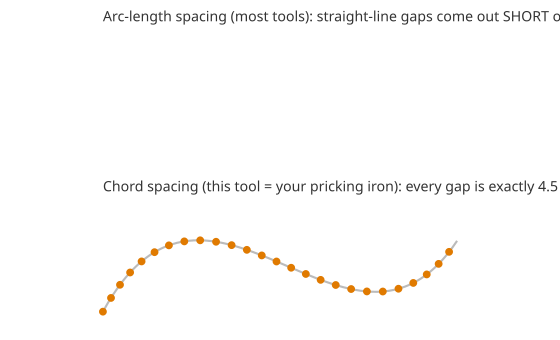
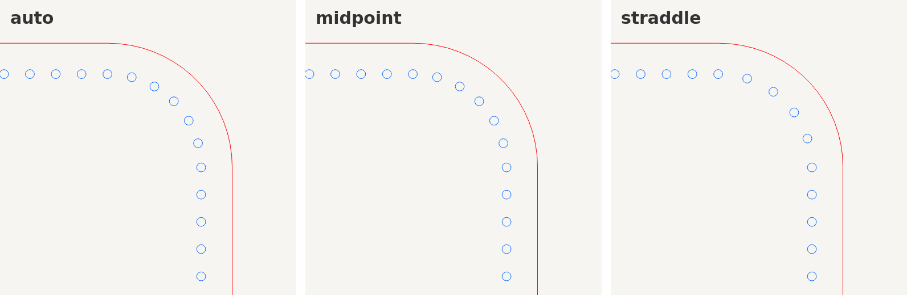
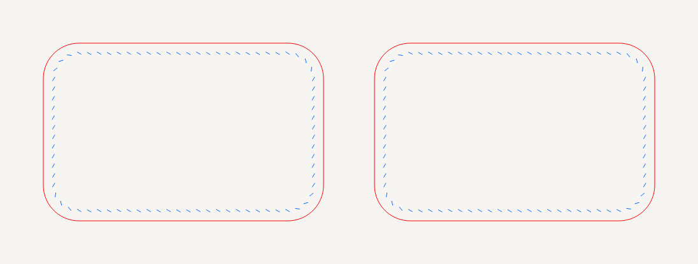
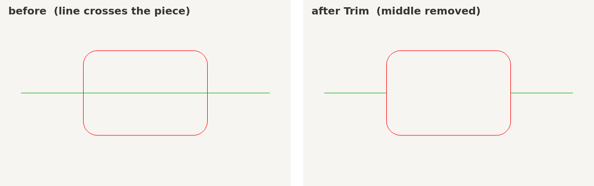
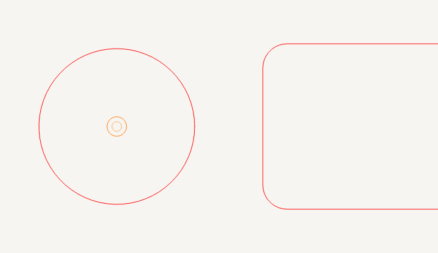
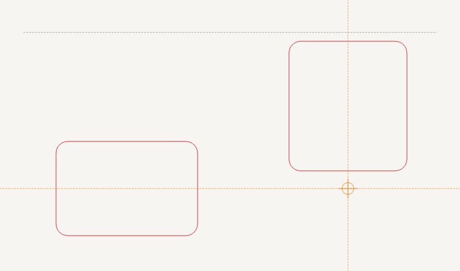

# Leather-Drafting

A Python desktop **CAD program for laser-cut leather patterns**, built around the
one thing most pattern software gets wrong for hand-stitchers: **stitch hole
spacing that matches a real pricking iron**, and holes that **line up perfectly
across overlapping pieces** no matter which side you laser.


> Status: v0.2. The desktop app (draw / radius / move-overlay / per-iron holes /
> layers / registration / SVG+DXF export) is working and tested. Roadmap below.

---

## Two problems this is designed around

### 1. Pricking-iron spacing, not contour spacing
Ask most tools for "3.85 mm spacing" and they drop a hole every 3.85 mm *of arc
length* along the contour. On a curve the actual straight-line gap between
neighbouring holes then comes out **short**, so the holes never match your
physical iron, whose teeth are rigid and a fixed **straight-line (chord)**
distance apart.

Leather-Drafting does **chord marching**: from each hole it finds the next point
forward along the path whose straight-line distance is exactly the iron's pitch.
Consecutive holes are always `pitch` apart point-to-point — exactly what the iron
does as you rotate it around a curve.



It also nudges the pitch a few percent (within a limit you set) so a whole number
of holes lands cleanly on **every corner** and on **both ends** of an open seam —
the thing leatherworkers do by hand.

On a **rounded corner** the holes come out **symmetric about the arc's
midpoint** — either a stitch sitting right on the 45° apex or an even pair
straddling it, never a lone hole landing off-centre. A generous corner is fitted
as its own span; a **tight corner** collapses to a single clean hole on the apex
instead of cramming several holes into a couple of millimetres. Pick `auto`
(whichever count best matches your iron), `midpoint`, or `straddle` per shape. A
happy side effect: a symmetric outline now gets flip-symmetric holes for free.



### 2. Registration across overlapping pieces
Two pieces stitched together (front + lining, gusset + panel) must have their
holes in **identical positions** or they won't line up. Leather-Drafting
guarantees this three ways:

- **Deterministic perimeter stitching** — two pieces with the same outline and
  settings get *byte-identical* hole layouts automatically. Duplicate a panel and
  the holes already match.
- **Mirror-safe** — flip a piece to laser it from the back (`Mirror`) and the
  holes stay registered, hole-for-hole.
- **Shared stitch line (seam)** — for pieces with *different* outlines that share
  one edge, draw one seam and every piece against it gets the same holes.

Verify any of it visually by dragging one piece on top of another and dropping the
opacity — the tool is built for exactly that overlay check.

Need the matching reverse-side piece? **Make back piece** (`Ctrl+M`) drops a
mirror-image copy whose holes stay registered hole-for-hole — ready to laser from
the back. The slanted slits mirror too, so they line up when the piece is flipped:



## Install & run

```bash
git clone <this repo>
cd Leather-Drafting
pip install -e ".[gui]"        # installs PySide6; Python 3.9+
python -m leathercad_app       # or: leather-drafting
```

On **Windows/macOS** the PySide6 wheel is self-contained. On headless **Linux**
you may need system libs: `sudo apt-get install libegl1 libgl1 libxkbcommon0`.

The engine alone (spacing, geometry, export) has **zero dependencies** — you only
need PySide6 for the GUI.

## Using the app

The drawing tools live in a **vertical tool palette docked on the left**. It is
a normal draggable toolbar — grab its handle to move or float it, drop it on any
edge, and use the **pin** button at the top to lock it in place. Its position
(and the window layout) is remembered between sessions.

| | |
|---|---|
| **Draw** | Rectangle `R`, Rounded rect `O`, Ellipse `E`, Circle `C`, Polygon `P` (click points, double-click to finish), Line `L` (2-point) |
| **Circle by points** | **2-point circle** `2` (click the two ends of a diameter) and **3-point circle** `3` (click three points on the rim) — snap them onto existing geometry to fit a circle exactly |
| **Arc** | **3-point arc** `4` (click start, end, then a point on the arc to set its bulge) and **centre arc** `5` (click centre, start, then end — sweeps counter-clockwise). Arcs are kept as real arcs (an editable `EditablePath`), so double-click to node-edit and drag the midpoint handle to reshape; they stitch and export like any edge |
| **Pen / bezier** | Pen `B` — click to drop a **corner** anchor, or **click-drag** to pull out a smooth tangent handle (standard vector-pen behaviour; drag farther for a deeper curve). Consecutive anchors are joined by **cubic bezier curves**. **Right-click** (or `Enter`) finishes an open curve; **click the first anchor** to close it; `Esc` cancels. The result is a node-editable curve: enter node-edit (double-click) and drag the green **control handles** to reshape each curve, or drag an anchor and its handles follow. Curves get default stitching like any shape (toggle it off in Properties), and flatten cleanly for chord-accurate holes and export |
| **Construction line** | `G` — a dashed guide you drag out; it's a snap/alignment reference only, never cut or exported |
| **Drawing style** | **every drawing tool places points by clicking** — no click-and-hold. Two-point tools (rect, rounded, ellipse, circle, slot, line, construction) take two clicks; polygon / seam / score take clicks then a double-click (or `Enter`); hole is one click. Prefer press-drag-release for the two-point tools? Toggle **View → Drag to draw** (remembered between sessions). Hold **Shift** while placing any line — line, construction, score, or seam — to lock the segment to **0° / 45° / 90°** from the previous point. `Esc` cancels a point you're mid-placing; press `Esc` again (nothing in progress) to drop back to the pointer |
| **Holes / slots / fold lines** | Hole `H` (hardware), Slot `T` (stadium), Score line `K` (fold/skive on the Score layer) |
| **Seam** | Stitch line `M` — a shared seam for cross-piece registration |
| **Select / move** | `S` — drag to move, drag one piece over another to check fit |
| **Line width** | toolbar **line** spinbox sets the on-screen stroke width for outlines, seams, dimensions and text (remembered between sessions) |
| **Snapping** | two independent toolbar toggles — **Nodes** and **Grid** — plus grid size. Node snap catches real geometry: **endpoints, edge & arc midpoints, arc/shape centres, circle quadrants, stitch-hole centres, intersections, and the midpoints of the pieces an intersection carves out** (bisect a line and you can grab its quarter points) — no phantom bounding-box points. Turn Grid off to snap only to geometry (points off a node stay free). Both apply while drawing and moving. Dragging a **circle** locks by its **centre** — the centre wins over the quadrants so you can drop it straight onto another node. **Construction/guide lines** also snap **anywhere along their body** (nearest-point-on-line), and where a guide crosses a line the **junction** splits it so the resulting sub-segment midpoints are snappable from anywhere along them |
| **Alignment guides** | while drawing, when the cursor lines up with another object's node/centre the point locks to that x/y and a dashed **guide line** appears (smart snapping, Fusion/Illustrator style) |
| **Exact sizes** | live W×H shown while dragging; after drawing, the size field is focused so you can type an exact value |
| **Resize handles** | select a single rectangle / circle / ellipse and drag one of the **8 box handles** (4 corners + 4 edge midpoints) to resize by eye — the opposite corner/edge stays pinned. Or type exact dimensions in Properties; both stay in sync |
| **Select by outline** | shapes are grabbed by clicking their outline, not the filled interior — click "inside" to reach shapes behind or draw there |
| **Edit nodes** | double-click a polygon/seam, or right-click a shape → *Convert to editable nodes* (`Ctrl+K`). Rounded corners keep their **arcs**: each arc shows its two endpoints plus a midpoint handle you drag to reshape the curve. The shape locks while editing so clicks grab the nodes. Hold **Shift** while dragging a node to lock its movement to **0° / 45° / 90°** from where the drag began (so an endpoint drags straight up into a vertical line). |
| **Line length / angle** | select a line and type its **Length** and **Angle** in Properties (the first point stays put) — not just its x/y position |
| **Snap to nodes** | with Snap on, dragging a shape (or a node while editing) magnetically snaps to other shapes'/holes' nodes |
| **Break apart** | right-click a shape → *Break apart into segments* (`Ctrl+B`) — each edge (line or arc) becomes its own movable piece |
| **Join / weld** | select 2+ pieces → *Join / weld segments* (`Ctrl+J`) — chains segments whose endpoints touch into one path (arcs kept) |
| **Trim** | Trim tool (`X`) — click the part of an outline you want gone; it's cut back to wherever it crosses another shape, just like Fusion 360 / LightBurn. Arcs are preserved; a closed shape opens, an open one splits |
| **Text** | Text tool (`A`) — click to place **engrave lettering**; glyph outlines are baked to paths on the Engrave layer and export as engrave polylines |
| **Measure** | Measure tool (`Q`) — click two (snapped) points for a live **length / angle / dx / dy** readout in the status bar |
| **Dimension** | Dimension tool (`D`) — click two points to drop a permanent **dimension annotation** (extension lines, arrows, measured length). Snap the ends onto a shape and the dimension **tracks it**: move or resize the shape and the length updates. Annotations only — never cut or exported |
| **Group (move together)** | select two or more items (holes, shapes, seams) → **Group** (`Ctrl+G`) — they share a group and move as one unit; clicking any member selects the whole group. **Ungroup** (`Ctrl+Shift+G`) breaks it apart. Survives save/undo |
| **Attach holes to shape** | *Attach holes to shape* (`Ctrl+Shift+A`) bakes loose holes into a single shape so they ride with it for cross-piece registration; *Explode stitching → holes* turns a shape's stitching back into individual, deletable holes |
| **Right-click menu** | Group / Ungroup / Attach holes / Convert to nodes / Duplicate / Delete on the selection |
| **Radius corners** | select a rectangle/polygon, set *Corner radius* in Properties |
| **Iron & holes** | per shape: pick an iron (mm or SPI), inset, round or slanted-slit holes, single or **double row** (saddle stitch) + backstitch, live hole count + spacing readout |
| **Corner holes** | rounded-corner holes are always **symmetric about the arc midpoint**. Stitching → *Corners*: `auto` (best count for your iron), `midpoint` (a hole on the apex), `straddle` (an even pair around it) |
| **Back-to-back symmetry** | Stitching → *Symmetry* (vertical/horizontal) forces flip-symmetric holes; Edit → *Check back-to-back symmetry* validates that a flipped piece lines up |
| **Make back piece** | Edit → *Make back piece* (`Ctrl+M`), or right-click → *Make back piece (mirror)* — drops a mirror-image copy whose holes stay registered with the front so the two stitch together back-to-back |
| **Layers → laser jobs** | colour-coded Cut / Score / Engrave / Stitch layers with **Show/Hide** visibility. A piece's blue stitch holes follow the **Stitch** layer, so you can hide **Cut** to see just the stitch pattern (or hide Stitch to see the bare outline) |
| **Arrange** | align (left/centre/right/top/middle/bottom) and distribute selected shapes |
| **Undo / redo** | `Ctrl+Z` / `Ctrl+Shift+Z` |
| **Duplicate / Delete / Fit** | `Ctrl+D` / `Del` or `Backspace` / `F` |
| **Zoom / pan** | mouse wheel / middle-drag |
| **Save / Open** | `Ctrl+S` / `Ctrl+O` (JSON project files) |
| **Export** | SVG `Ctrl+E` or DXF — millimetre-accurate, layer-coloured. DXF outlines export as connected **POLYLINE**s (closed shapes carry the closed flag), so LightBurn / Illustrator import them as one contour instead of loose line segments |

Everything is in **millimetres**, Y-up, and the canvas is WYSIWYG with the export.

### Trim

Pick the **Trim** tool (`X`) and click the part of an outline you want gone. It
is cut back to the two points where it crosses other geometry — the classic
2D-sketch trim from Fusion 360 / LightBurn. Curve type is kept (a trimmed arc
stays an arc); a closed shape opens up, and an open path clicked in the middle
splits into two. Clicking a piece that nothing crosses removes it outright.



### Smart snapping & construction lines

While a drawing tool is active, the snap targets near the cursor are **marked on
screen** so you always know where a click will land — a **square** for an
end/corner, a **diamond** for a midpoint or circle quadrant, a **circle** for a
shape/arc centre, a small **ring** for a stitch-hole centre, an **✕** for an
intersection — and the point you're placing snaps to the nearest one (its type
is named in the status bar). All targets come from real geometry, so nothing
floats off a rounded or round outline.

When the point lines up (same x or y) with a nearby **endpoint, midpoint or
centre**, it **locks to that alignment** and a dashed orange **guide line** is
drawn — the same inference snapping as Fusion 360 / Illustrator. (Stitch holes
and intersections don't drive guides, so the lines stay meaningful even on a
piece with a hundred holes.) Line up with two things at once and it snaps to the
crossing point.



Node snapping and grid snapping are **separate toolbar toggles** (*Nodes* and
*Grid*). Turn *Grid* off to snap purely to geometry — points that aren't on a
node then stay wherever you put them.

Drag out a **construction line** (`G`) for a reusable guide of your own: it's
dashed, snappable, and never cut or exported.



### Group / ungroup holes (removing individual ones)

By default a shape's holes are *computed* from its stitch settings, so they stay
evenly spaced when you change the iron or resize — but that means the engine
would redistribute them if you deleted one. To hand-edit holes (say, to clear a
spot for a rivet):

- **Ungroup** (right-click → *Ungroup stitching*, or `Ctrl+Shift+G`) explodes the
  shape's holes into **individual holes** and turns its auto-spacing off. Each
  hole is now an ordinary object — **click one to select it** (rubber-band to
  select many), drag to nudge, press **Delete** to remove. Nothing reflows; the
  gap stays exactly where you made it.
- **Group** (right-click → *Group holes into shape*, or `Ctrl+G`) does the
  reverse: select a shape **and** the loose holes, and they get baked back into
  the shape so they move and rotate with it as one unit — still without
  redistribution.

Right-click anywhere for the context menu (Group / Ungroup / Duplicate / Delete).


## Scripting API (no GUI needed)

The whole model is usable headless — handy for parametric patterns:

```python
from leathercad import Document, Rectangle, Transform, StitchSettings, get_iron, export

doc = Document("wallet")
iron = get_iron("3.85mm")
for x in (0, 120):                       # front + lining, placed apart
    doc.add_shape(Rectangle(
        width=95, height=65, corner_radius=10,
        transform=Transform(x=x, y=0),
        stitch=StitchSettings(pitch_mm=iron.pitch_mm, inset=3.5,
                              hole_style="slit", slit_angle=30),
        layer="Cut"))

export.export_svg(doc, "wallet.svg")
export.export_dxf(doc, "wallet.dxf")
doc.save("wallet.leathercad.json")
```

Runnable examples:

```bash
python examples/wallet_document.py   # builds a doc, proves registration, exports
python examples/card_holder.py       # engine demo: chord vs arc-length on a curve
```

## Tests

```bash
pip install -e ".[dev]" && QT_QPA_PLATFORM=offscreen pytest
```

The suite proves the guarantees that matter: chord spacing equals the iron pitch
on curves while arc-length spacing is measurably short; identical and mirrored
pieces get registered holes; save/load and SVG/DXF export round-trip.

## Project layout

```
leathercad/            pure-Python model + engine (no dependencies)
  geometry.py          Vec2 / vector math
  path.py              segments (line/arc/bezier), Path, PathBuilder, flattening
  offset.py            inward polygon offset (stitch-line inset)
  stitching.py         chord/arc marching + fitting + registration  <- the core
  stitchsettings.py    per-shape/seam stitch config
  shapes.py            Rectangle/Ellipse/Circle/Polygon/PathShape/EditablePath (line/arc/bezier) + transform + fillet
  layers.py            colour layers -> laser jobs
  stitchline.py        shared seam for cross-piece registration
  document.py          the CAD document + JSON save/load
  irons.py             pricking-iron pitch / SPI presets
  export.py            SVG + DXF exporters
leathercad_app/        PySide6 desktop app
  canvas.py            mm-accurate Y-up QGraphicsView, tools, grid, zoom/pan
  items.py             shape/seam graphics items with live hole rendering
  panels.py            properties + layers docks
  mainwindow.py        window, toolbar, menus, export wiring
  __main__.py          python -m leathercad_app
examples/  tests/  docs/
```

## Roadmap

- [x] Draw rectangles / rounded rects / ellipses / circles / polygons
- [x] Radius (fillet) corners
- [x] Move & overlay shapes (opacity) to verify sizing
- [x] Per-shape pricking-iron sizes (mm or SPI), round or slanted-slit holes
- [x] Chord (iron-accurate) spacing with corner/endpoint fitting
- [x] Cross-piece registration (deterministic + mirror-safe + shared seams)
- [x] Colour layers → laser jobs
- [x] SVG + DXF export, JSON project save/load
- [x] Undo/redo history
- [x] Grid + vertex snapping, live and type-in dimensions
- [x] Align / distribute
- [x] Edit polygon/seam vertices; add holes / slots / skive (score) lines
- [x] Two-row saddle stitch + backstitch markers
- [x] Left tool palette (draggable / floatable / pinnable, layout remembered)
- [x] Group / ungroup holes (individual selectable holes; group back to a shape)
- [x] Right-click context menu (group / ungroup / convert-to-nodes / duplicate / delete)
- [x] Convert a shape to editable nodes (rounded corners keep arcs: midpoint +
      endpoint handles); outline-based selection; node-to-node snapping (move + edit)
- [x] Break a shape apart into movable line/arc segments, and join/weld them back
- [x] Flip-symmetric hole distribution + back-to-back symmetry validation
- [x] Symmetric rounded-corner holes (apex / straddle) + make-back-piece (mirror)
- [x] Trim to intersections (Fusion / LightBurn style), arcs preserved
- [x] Alignment guides (smart snapping) + Line and construction-line tools
- [ ] Boolean ops (windows, cut-outs) and true seam-allowance offset
- [ ] Import reference images / trace an existing pattern
- [ ] Print-to-scale PDF tiling for hand cutting

## License

MIT.
