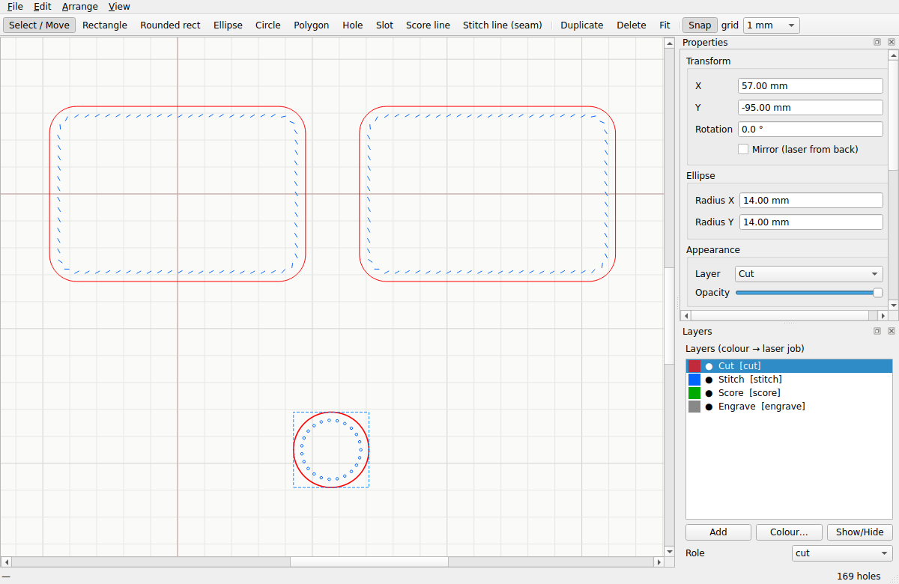
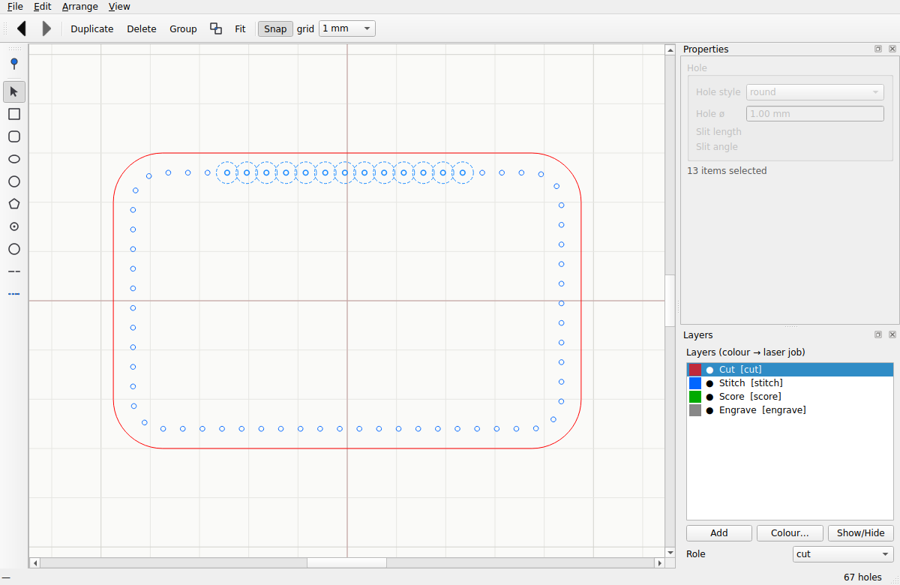

# Leather-Drafting — User Guide

*A CAD program for laser-cut leather patterns with pricking-iron-accurate stitch holes.*



---

## Contents

1. [Why this program exists](#1-why-this-program-exists)
2. [Installing and launching](#2-installing-and-launching)
3. [The workspace](#3-the-workspace)
4. [Quick start — a pattern in five minutes](#4-quick-start--a-pattern-in-five-minutes)
5. [Drawing tools](#5-drawing-tools)
6. [Selecting and editing](#6-selecting-and-editing)
7. [Stitching — the deep dive](#7-stitching--the-deep-dive)
8. [Precision drawing: snapping and guides](#8-precision-drawing-snapping-and-guides)
9. [Modify tools: trim, break, weld, offset, array](#9-modify-tools-trim-break-weld-offset-array)
10. [Measure, dimensions and text](#10-measure-dimensions-and-text)
11. [Layers](#11-layers)
12. [Saving, exporting and cutting](#12-saving-exporting-and-cutting)
13. [Printing at 1:1](#13-printing-at-11)
14. [Tutorial 1 — a stitched card holder](#14-tutorial-1--a-stitched-card-holder)
15. [Tutorial 2 — a curved key fob with the pen tool](#15-tutorial-2--a-curved-key-fob-with-the-pen-tool)
16. [Tutorial 3 — two pieces sharing one seam](#16-tutorial-3--two-pieces-sharing-one-seam)
17. [Keyboard shortcuts](#17-keyboard-shortcuts)
18. [Troubleshooting & FAQ](#18-troubleshooting--faq)
19. [Glossary](#19-glossary)

---

## 1. Why this program exists

Most drawing programs place stitch holes at a fixed distance **along the
contour** (arc length). On a curve, the straight-line gap between neighbouring
holes then comes out *shorter* than the spacing you asked for — so the holes
never line up with a physical pricking iron, whose teeth are a rigid,
fixed straight-line distance apart.

Leather-Drafting instead does **chord marching**: from each hole it finds the
next point along the path whose *straight-line* distance is exactly your
iron's pitch. That reproduces what an iron physically does as you walk it
around a curve. It also does what leatherworkers do by hand: nudge the
effective pitch a few percent so a whole number of holes lands cleanly on
every corner and both ends of a seam.

Everything else — shapes, layers, export — exists to serve that.

Units are **millimetres** everywhere. 1 unit = 1 mm, on screen and in every
export.

---

## 2. Installing and launching

You need Python 3.9+ and PySide6.

```bash
git clone <this repository>
cd Leather-Drafting
pip install -e ".[gui]"
```

Launch either way:

```bash
leather-drafting          # installed command
python -m leathercad_app  # or directly from the repo
```

Run the test suite any time with `python -m pytest` — everything in this
guide is covered by it.

### Sharing the app with family & friends

Recipients don't need Python. Build a double-clickable app once and send it:

```bash
cd packaging
./build_macos.sh        # macOS  -> dist/Leather-Drafting.app
build_windows.bat       # Windows -> dist\Leather-Drafting\Leather-Drafting.exe
./build_linux.sh        # Linux  -> dist/Leather-Drafting/Leather-Drafting
```

Zip the result and send it. Each script finishes by launching the freshly
built app in a self-check (`--smoke`) so a broken build never ships silently.
The user guide travels inside the app (Help → User guide still works).

> macOS note: the app is unsigned, so the first launch needs
> **right-click → Open** (once). Builds must be made *on* the platform they
> target — build the Mac app on a Mac, the Windows exe on Windows.

---

## 3. The workspace

* **Canvas** (centre) — your drawing. The grid is in mm; the origin is marked.
  * **Zoom**: mouse wheel — zooms **about the cursor** (the point under your
    mouse stays put, Fusion-style). **Pan**: drag with the middle mouse
    button. The canvas is effectively infinite; the grid coarsens as you zoom
    out so it stays readable.
  * **Fit to content**: `F` (or View → Fit to content).
  * **Rulers** — mm rulers frame the canvas (View → Rulers to toggle), with a
    marker tracking your cursor. **Drag out of a ruler** onto the canvas to
    drop a **guide**: the top ruler drops a horizontal guide, the left ruler a
    vertical one. Guides are ordinary construction lines — snappable along
    their whole length, never cut or exported, delete like any shape.
* **Tool palette** (left, draggable/pinnable) — drawing and modify tools.
  Related tools are grouped into **fan-out buttons**: *Rectangles*,
  *Circles & ellipse* and *Arcs*. Click the button for its current variant, or
  the small **▸ arrow** to pick another variant — the button remembers your
  choice. Every variant keeps its own keyboard shortcut.
* **Actions toolbar** (top) — Undo/Redo, Duplicate, Delete, Group, Ungroup,
  Fit, the **Nodes** and **Grid** snap toggles, the grid size, and the
  **line** width spinner (on-screen stroke width, 0.3–8 px).
* **Properties panel** (right, `Ctrl+1`) — everything about the selected item:
  position, size, rotation, mirror, layer, opacity, and the whole stitching
  section. Closed it? View → Properties panel, or View → Reset panels.
* **Layers panel** (right, `Ctrl+2`) — colour → laser-job mapping, visibility
  checkboxes, layer roles.
* **Parts library** (right, `Ctrl+3`) — *your* reusable pieces, kept across
  all documents: select shapes → **Save selection…**, then double-click a part
  in any project to place it at the view centre (fresh copies every time).
* **Status bar** (bottom) — cursor position in mm, live measurements and tool
  hints, and the total hole count.
* **Dark theme** — View → **Dark theme** switches the whole app (panels,
  canvas, rulers, tool icons) to a dark look; remembered between sessions.

---

## 4. Quick start — a pattern in five minutes

Don't want to start from nothing? **File → New from template** opens a
complete starter pattern — **Card holder**, **Belt** (with buckle slot, fold
line and sizing holes), **Key fob**, or the **Vertical wallet** — matching
the tutorials in this guide. Adapt and Save As.

The **Vertical wallet** is a minimalist **single-piece** wallet with a
fold-down top flap, in the style of the Oldis One: 70 × 100 mm closed. It
is drawn **flat**, bottom to top: the front pocket panel (folds **up** at
the lower score line, with a **diagonal opening edge** — lower on the
right, for right-handed thumb access), the back panel, and the tapered
**flap** above the upper score line, which folds **down** over the pocket
to keep cards and folded bills in — no snap or strap, just the leather's
memory. The two side seams are single straight stitch lines **centred on
the pocket fold**, so the fitted holes come out mirror-symmetric about it —
fold the front up and every front hole lands exactly on its back hole. The
flap is never stitched. Select the piece and **Make back piece** (`Ctrl+M`)
for a left-handed mirror.

### Tracing a real object

Want to digitize a wallet you already own? Photograph or scan it with a ruler
in the shot, then **View → Tracing image → Place image…**. The photo sits
behind the canvas at half opacity. Now **Calibrate scale**: click two points a
known distance apart (the ruler ends), type the real distance — the photo
rescales so 1 mm on it is 1 mm for real. Trace over it with the pen/line
tools; the image is never exported and is saved with your project. Adjust
opacity, hide, or remove it from the same menu.

1. Press `R` (Rectangle). Click once for the first corner, move, click again
   for the opposite corner. *(Prefer press-drag-release? Toggle
   View → Drag to draw.)*
2. The size fields focus automatically — type an exact **Width** and
   **Height** (say 100 × 70) and press Enter.
3. In Properties, the **Stitching** box is already on: you get a blue row of
   stitch holes inset 3.5 mm from the edge at a 3.85 mm pitch.
4. Pick your iron from the **Iron** dropdown (pitches shown in mm and SPI) —
   the holes redistribute instantly. The readout at the bottom of the panel
   shows the hole count and the exact chord spacing range.
5. File → **Export SVG** (`Ctrl+E`) or **Export DXF** — send that to your
   laser software. Done.

---

## 5. Drawing tools

Every drawing tool places points **by clicking** — no click-and-hold needed.
Two-point tools take two clicks; multi-point tools take several clicks and
finish with a double-click or `Enter`. `Esc` cancels the shape in progress;
press `Esc` again (with nothing in progress) to drop back to the Select tool.
After a shape is created the tool returns to **Select** and the primary size
field is focused so you can type an exact value.

Hold **Shift** while placing any line-like point to lock the segment to
**0° / 45° / 90°**.

| Tool | Key | How to use |
|---|---|---|
| **Select / Move** | `S` | Click an item's outline to select; drag to move. |
| **Rectangle** | `R` | Two clicks: opposite corners. |
| **Rounded rect** | `O` | Same, with a corner radius you can edit in Properties. |
| **Ellipse** | `E` | Two clicks: bounding corners. |
| **Circle** | `C` | First click = centre, second sets the radius. |
| **Circle (2-point)** | `2` | Click the two ends of a **diameter**. |
| **Circle (3-point)** | `3` | Click three points on the rim — the circle is fitted through them. |
| **Arc (3-point)** | `4` | Click the **start**, the **end**, then a point the arc must pass through (its bulge). |
| **Arc (centre)** | `5` | Click the **centre**, the **start** (sets the radius), then the **end** — sweeps counter-clockwise. |
| **Polygon** | `P` | Click each vertex; double-click or `Enter` to close. |
| **Pen (bezier curve)** | `B` | See below. |
| **Line** | `L` | Two clicks. Set exact **Length**/**Angle** afterwards in Properties. |
| **Construction line** | `G` | A dashed guide — snappable, never cut or exported. |
| **Hole** | `H` | One click places a round hardware hole (cut only, no stitching). |
| **Slot** | `T` | Two clicks; a stadium-shaped slot (for buckle tongues, strap slots). |
| **Score line** | `K` | Click points; lands on the **Score** layer (fold/skive/decoration). |
| **Stitch line (seam)** | `M` | A standalone seam of holes — see [Tutorial 3](#16-tutorial-3--two-pieces-sharing-one-seam). |
| **Trim** | `X` | Click the piece of an outline you want gone (red preview on hover). |
| **Fillet / chamfer corner** | `6` | Click any corner of a polygon/path to **round** it with a true arc; **Shift-click** to chamfer (bevel); **Ctrl-click** to change the radius. |
| **Extend to intersection** | `7` | Click the **end** of a line/path: it grows until it meets the next outline or guide (the opposite of Trim). |
| **Offset outline** | `8` | Click a shape, then move the cursor **inside or outside** it — a dashed preview follows with the live distance in the status bar. Click to place the offset copy, or press **Enter** to type an exact distance. Circles offset to true circles and rounded rectangles keep proper rounded corners. |
| **Text** | `A` | Click to place engraved lettering. |
| **Measure** | `Q` | Two clicks; length/angle/dx/dy in the status bar. |
| **Dimension** | `D` | Two clicks; a permanent dimension annotation. |

### The pen tool (`B`)

Works like the pen in Illustrator/Inkscape:

* **Click** = a sharp corner anchor.
* **Click and drag** = a smooth anchor: you pull out a tangent handle, and the
  farther you drag, the deeper the curve. The curve and its handle bar preview
  live.
* **Right-click** or `Enter` = finish an **open** curve.
* **Click the first anchor** = **close** the curve.
* `Esc` = cancel.

The result is a true cubic-bezier path. **Double-click it** later to edit:
white squares are anchors, **green dots are the curve's control handles** —
drag them to reshape any bend. Dragging an anchor carries its handles along.
Curves are stitched, offset, exported and printed exactly like any other shape.

---

## 6. Selecting and editing

* **Click the outline** to select — shapes are grabbed by their edge, not
  their filled interior, so you can click "inside" a shape to reach things
  behind it. Selected outlines turn **blue**.
* **Ctrl/Shift-click** adds to the selection; drag a rubber band over items to
  select several. `Ctrl+A` selects everything.
* **Move**: drag. While dragging, the shape magnetically **snaps** to other
  shapes' endpoints/centres/midpoints (see §8). Circles and loose holes snap
  by their **centre**.
* **Resize by eye**: select one rectangle/circle/ellipse and drag any of the 8
  box handles — the opposite corner stays pinned. Holes recalculate for the
  new size automatically.
* **Resize exactly**: type in the Properties fields. Both stay in sync.
  **Every number field does math**: type `105/2 + 3`, `4*25.4`, or even
  `1in` / `3cm` and it evaluates on Enter.
* **Parameters** (`Ctrl+Shift+P`) — Fusion-style named values. Define
  `strap_w = 20` once in Edit → **Parameters…**, then type `strap_w` (or
  `strap_w*2+5`) into any numeric field. A field set from a parameter stays
  **linked**: change the parameter and every linked field re-evaluates and
  the shapes update. Re-type a plain number into a field to unlink it.
  Parameters may reference each other (`half_w = strap_w/2`) and understand
  units (`1in`), are saved in the file, and a parameter edit is one undo
  step. Great for "the whole wallet, resizable from one table".
* **Rotate**: drag the round **rotation grip** floating above a selected
  shape's box — snaps to 1° (hold **Shift** for 15° detents) — or type an
  exact angle in Properties → Rotation.
* **Mirror**: Properties → "Mirror (laser from back)".
* **Duplicate**: `Ctrl+D` (copies land beside the original).
* **Delete**: `Delete` or `Backspace`.
* **Undo / Redo**: `Ctrl+Z` / `Ctrl+Shift+Z` — every discrete edit is undoable.
* **Group (move together)**: select 2+ items, `Ctrl+G`. Clicking any member
  now selects and moves the whole group; `Ctrl+Shift+G` ungroups. Groups
  survive saving.
* **Make back piece (mirror)**: `Ctrl+M` creates a mirrored copy — for the
  back of a wallet or bag — with hole layouts that line up back-to-back.
  Loose holes sitting inside the shape are mirrored with it.
  Edit → *Check back-to-back symmetry…* verifies the hole sets line up.
* **Align / Distribute**: the Arrange menu aligns edges/centres and spaces
  items evenly.

### Node editing

**Double-click** a polygon, path, curve or seam (or right-click → *Edit
nodes* / *Convert to editable nodes*, `Ctrl+K`) to edit its geometry
point-by-point:

* **White squares** — on-path vertices. Drag them; they snap to other
  geometry. Hold **Shift** to constrain the node's movement to 0/45/90°.
* **Orange circles** — arc midpoints. Drag to reshape the arc.
* **Green dots** — bezier control handles. Drag to reshape the curve (these
  move freely, no snapping).

* **Add a node**: double-click anywhere on a straight edge — a new vertex
  appears right there (arcs already have their midpoint handle).
* **Delete a node**: **Alt-click** it. Alt-clicking an arc's orange midpoint
  handle straightens that arc into a line. Shapes keep their minimum point
  count, so you can't delete a triangle down to nothing.

The shape itself is locked while node-editing so your clicks always land on
the handles. Click elsewhere / press `Esc` to leave node editing.

Rectangles, circles and ellipses are *parametric* — right-click → **Convert to
editable nodes** first turns them into an editable path (rounded corners keep
their true arcs).

---

## 7. Stitching — the deep dive

Select a shape and look at the **Stitching** box in Properties. Untick the box
to turn stitching off for that shape (the shape will not move — only the holes
disappear).

| Setting | What it does |
|---|---|
| **Iron** | Presets by pitch (mm) and SPI. Picking one sets Pitch; editing Pitch by hand flips it to *Custom*. |
| **Pitch** | The straight-line (chord) hole spacing — your iron's tooth spacing. Default 3.85 mm ≈ 6.6 SPI. |
| **Inset from edge** | How far the stitch line sits in from the cut edge. Default 3.5 mm. |
| **Fit** | How holes are fitted to the path. **auto** picks *closed* for closed outlines, *endpoints* for open ones — the pitch is nudged (≤ 12 %) so whole holes land on every corner and both ends. **none** marches at the *exact* pitch and lets the last hole fall wherever it lands. |
| **Hole style** | **round** (diameter below) or **slit** (length + slant angle, like a diamond awl). |
| **Rows** | **2 (double)** adds a second parallel row (aligned rungs) for saddle-stitched straps; set **Row spacing**. |
| **Backstitch** | Marks N holes at each end of an open seam as the backstitch zone (markers only — you sew back through existing holes). |
| **Symmetry** | Force the hole set to be mirror-symmetric about the shape's **vertical** or **horizontal** axis, so a flipped piece lines up back-to-back. |
| **Corners** | How holes sit on a rounded corner's arc: **auto** = best count for your iron, **midpoint** = force a hole on the apex, **straddle** = force a pair around a bare apex. Tight corners always collapse to a single apex hole — no cramming. |

The **readout** at the bottom shows the hole count, the min–max chord spacing
(these should hug your pitch), and the effective pitch per span.

### Seam mates — will these two pieces sew together?

Two pieces sewn to each other **must have the same hole count**. Select the
two stitched pieces (or seams) and run **Edit → Check seam mates…**: you get
each side's hole count, seam length and spacing, and a clear verdict. If they
differ, match the seam lengths, adjust pitch/fit — or use one shared **Stitch
line** so both pieces get identical holes by construction.

### How much thread do I need?

**Edit → Thread estimate…** computes the saddle-stitch thread for the
selection (or the whole pattern when nothing is selected). It models the real
consumption — thread on **both faces**, **two passes through every hole**,
needle tails at each end of every run, double rows as two runs, and the
backstitch zone — instead of the rough "4× the seam" rule (which under-buys
on short seams, where the needle tails dominate). Tell it your total leather
stack thickness and preferred tail length once; both are remembered. Cut
generously anyway.

### How much leather do I need?

**Edit → Area / leather usage…** lists every closed cut piece with its size
and area, then totals it in **cm² and square feet** (leather is sold by the
square foot) and suggests how much to buy given how much of a hide is really
usable (default 75 % — edges, brands and scars eat the rest). The Properties
panel also shows the selected piece's area.

### Loose holes and grouped holes

* Right-click a stitched shape → **Ungroup stitching → individual holes** to
  explode its stitching into individually movable/deletable holes. Move one,
  delete a few, add extras with the Hole tool.
* Select the shape plus loose holes → right-click → **Group holes into shape**
  (`Ctrl+Shift+A`) to bake them back in, so they ride with the shape. Baked
  holes are never redistributed — what you placed is what gets cut.



---

## 8. Precision drawing: snapping and guides

Two independent toggles in the top toolbar:

* **Nodes** — snap to real geometry: endpoints, edge/arc midpoints, shape and
  arc centres, circle quadrants, stitch-hole centres, intersections — and the
  midpoints of the *sub-segments* an intersection carves out (bisect a line
  with a guide and you can grab its quarter points). Construction lines snap
  anywhere along their body. There are **no** phantom bounding-box points.
* **Grid** — snap to the grid (size selectable next to the toggle, default
  1 mm). Turn Grid off to snap purely to geometry.

Both apply while **drawing** and while **moving**. A marker shows the snap
point and the status bar names it (*endpoint*, *midpoint*, *centre*,
*intersection*, *on line*…). When your cursor lines up with another object's
node or centre, a dashed **alignment guide** appears and the point locks to
that x/y — Illustrator-style smart guides.

While dragging a whole shape, it snaps by its own nodes (a circle by its
**centre**), so you can drop a circle exactly onto a centre point without any
extra construction.

---

## 9. Modify tools: trim, break, weld, offset, array

* **Trim** (`X`) — click the part of an outline you want gone; it is cut back
  to where it crosses other geometry, like Fusion 360 / LightBurn trim. The
  doomed piece highlights red on hover. Arcs survive trimming as arcs.
* **Break apart** (`Ctrl+B`) — explode a shape into its individual edges
  (lines and arcs), each independently movable.
* **Join / weld** (`Ctrl+J`) — select several touching segments and weld them
  back into one continuous path (arcs kept). **If the weld closes into a
  loop, the shape gets stitch holes automatically** — so *draw lines → weld →
  stitched piece* is one step (untick Stitching in Properties for a cut-only
  piece). Loose holes inside a welded outline can then be attached with
  `Ctrl+Shift+A`.
* **Offset / seam allowance** (`Ctrl+Shift+O`) — create a parallel copy of the
  selected outline: positive = outward, negative = inward. Use it for seam
  allowances, linings, or an outer glue line. Circles and (rounded)
  rectangles offset to true circles / rounded rectangles; other outlines
  become polygons with mitered corners. For a visual, cursor-driven version
  use the **Offset outline** tool (`8`): click the shape, move inside or
  outside, click to place (or press Enter for an exact distance).
* **Boolean operations** — select two or more **closed** shapes:
  **Union (merge shapes)** (`Ctrl+U`) welds them into one outline;
  **Subtract (bottom − top)** (`Ctrl+Shift+U`) removes the upper shapes from
  the bottom one (Illustrator "Minus Front" — the shape drawn first is the
  one that survives); **Intersect** keeps only the overlap. The result keeps
  the bottom shape's layer and stitching (holes re-fit to the new outline).
  Subtracting a shape that sits *fully inside* leaves it as a cutout ring —
  which is exactly what the laser needs. Shapes that merely share an edge
  (no overlap) can't be merged — overlap them slightly first.
* **Array** (`Ctrl+Shift+R`) — repeat the selection in a **grid**
  (rows × columns at spacings) or a **circle** (count around a centre,
  optionally rotating each copy). Perfect for belt holes and decorative
  punching.
* **Card pocket stack** (Edit menu) — generates every piece of a stepped
  wallet interior from real numbers: card size (bank card 85.6 × 54 pre-set),
  pocket count, reveal step, pocket depth and side allowance. Widths come out
  so a card clears the side seams; the backing panel height is computed so a
  card in the last pocket hides its bottom and shows its head. Pieces land
  bottom-aligned in a row, named `Pocket 1 (front)` … `Pocket backing`.
* **Zipper opening** (Edit menu) — a correctly-sized zip **window** (stadium
  slot) with its stitch line already running around it at your offset. Pick
  the gauge — `#3` (6 mm window), `#5` (8 mm) or `#8` (10 mm) — and the
  opening length. Slot and stitch ring arrive **grouped**, so you drag the
  pair onto your panel as one; Subtract the slot (or just cut) and sew
  through the ring.
* **Nest on sheet** (`Ctrl+Shift+N`) — pack the selected pieces (or
  everything, if nothing is selected) onto one sheet of leather. Enter the
  sheet size, an edge margin and the minimum gap between pieces; the packer
  uses each piece's **real outline**, so a flap can tuck into a gusset's
  hollow instead of blocking out its whole bounding box. Grouped shapes nest
  as one piece, and anything sitting *inside* a piece — slots, hardware
  holes, loose stitch holes, seams, lettering — automatically travels with
  it. The sheet is drawn as a dashed construction rectangle (it never
  exports), pieces that don't fit stay where they were and are named in the
  report, and **Allow 90° rotation** can be turned off when grain or stretch
  direction matters. Pieces are placed biggest-first; it aims for a tight,
  sensible layout, not a mathematically perfect one — nudge afterwards if
  you spot a better pocket.
* **Fillet / chamfer** (`6`) — click any corner of a polygon or path to round
  it with a real arc (asks the radius on first use; **Ctrl-click** to change
  it, **Shift-click** for a straight chamfer instead). It also works across
  **two separate lines whose ends meet**: draw two lines into a corner (they
  snap), click the corner, and the lines are **welded into one path** with the
  arc between them — the classic draft-then-round workflow. The radius clamps
  so it never eats past an edge's midpoint. Rectangles/parametric shapes:
  just set Corner radius in Properties, or convert to nodes first (`Ctrl+K`).
  The rounded corner stays a true arc — node-edit it later, and stitching
  treats it like any rounded corner (symmetric holes about the apex).

---

## 10. Measure, dimensions and text

* **Measure** (`Q`) — click two points (they snap): the status bar shows
  length, angle, dx and dy. Nothing is added to the drawing.
* **Dimension** (`D`) — click two points: a permanent dimension annotation is
  drawn (extension lines, arrows, the measured length). If you snapped the
  ends onto a shape, the dimension is **associative**: move or resize the
  shape and the dimension follows and re-measures. Dimensions are annotations
  only — never cut, never exported.
* **Text** (`A`) — click, type your text: the glyph outlines are baked to real
  paths on the **Engrave** layer and export as engrave polylines. (Text is
  baked at creation; to change it, delete and re-place.)

---

## 11. Layers

The Layers panel maps **colour → laser job**. A new document has:

| Layer | Colour | Role |
|---|---|---|
| Cut | red | cut |
| Stitch | blue | stitch (the holes themselves) |
| Score | green | score (folds, skiving, decoration) |
| Engrave | grey | engrave |

* **Tick / untick** a layer's checkbox to show or hide it. Hidden layers are
  **not exported**.
* Hiding **Cut** does *not* hide a shape's blue stitch holes — outline
  visibility and stitch visibility are independent, so you can inspect
  stitching alone.
* **Colour…** changes a layer's colour (that colour is what your laser
  software maps to an operation).
* **Role** tells the exporter what the layer means; **Add** creates extra
  layers if your laser workflow needs more colour channels.
* The layer dropdown in Properties moves the selected shape between layers.

---

## 12. Saving, exporting and cutting

* **Save / Open** (`Ctrl+S` / `Ctrl+O`) — projects are plain JSON
  (`*.json` / `*.leathercad.json`). Everything round-trips: shapes, curves,
  stitching settings, baked holes, groups, dimensions, text, layers.
* **File → Open recent** lists your last eight patterns (files that no longer
  exist quietly drop off). **File → New from template** starts from a complete
  example instead of a blank canvas.
* **Import SVG / DXF** (`Ctrl+I`) — bring existing patterns in as editable
  shapes. Curves flatten to fine outlines; closed contours arrive as smooth
  polygons, open ones as paths; circles/ellipses arrive as **real circles**
  (light and fast to drag, not dense polygons). **Stroke colours map onto
  your layers** (red → Cut, blue → Stitch, green → Score, grey → Engrave, or
  whatever your layer colours are; DXF colours map the same way) — and any
  **circle that lands on the Stitch layer is classified as a real stitch
  hole** automatically, so a stitched pattern round-trips cleanly. Stitching
  is off on imported outlines (enable per piece in Properties). SVG paths
  (beziers, arcs, group transforms) and the common DXF entities (lines,
  circles, arcs, polylines with bulge arcs) are supported; millimetre scale
  comes from the SVG width/viewBox (px assumed 96 dpi), DXF is read as mm.
* **Circles → stitch holes** (Edit menu) — manually reclassify any selected
  circles as loose stitch holes (for imports where hole colour didn't match a
  layer); then attach them to their piece with `Ctrl+Shift+A`.
* **Your work is safe.** A `•` in the title bar means unsaved changes; closing
  then asks whether to save. Unsaved work is also **auto-saved every two
  minutes**, and if the program (or your computer) ever dies, the next launch
  offers to **recover** exactly where you were. If something goes wrong
  internally you get a plain-language dialog — your work is auto-saved first,
  and the technical details land in an error log you can send along with a bug
  report.
* **Export SVG** (`Ctrl+E`) — millimetre-accurate, hairline strokes, grouped
  and coloured by layer. Ideal for LightBurn, Inkscape, or a browser preview.
* **Export DXF** — R12 DXF. Outlines are written as connected **POLYLINE**s
  (closed shapes carry the closed flag), so LightBurn / Illustrator /
  QCAD import each piece as one contour, not loose segments.
* Stitch holes export as real circles (or slit lines) sized from your hole
  style — cut them straight through, and they match your iron.
* Construction lines and dimensions are never exported.

* **Kerf compensation** — the laser burns away a thin line of material (the
  *kerf*), so uncompensated pieces come out slightly small and holes slightly
  big. Set your laser's kerf in the toolbar **kerf** box (typically
  0.1–0.3 mm; cut a 20 mm test square and measure to find yours). On SVG/DXF
  export, outer cut lines grow by half the kerf, nested cutouts (slots,
  hardware holes) and stitch holes shrink — so everything comes out
  **drawn-size**. The value is saved with the document. Leave it at 0 if you
  prefer to set kerf in your laser software instead — **never both**.
  Kerf assumes a cut layout (pieces side by side); 1:1 printing is never
  kerf-compensated.

**Typical LightBurn workflow**: Export SVG → drag into LightBurn → the red
layer becomes your cut, blue becomes the stitch-hole cut (small holes: slow
speed, full power works well), green a light score, grey an engrave.

---

## 13. Printing at 1:1

Two ways, both guaranteed true to scale (1 mm on paper = 1 mm in the pattern):

* **File → Export PDF (1:1, tiled)…** — writes a PDF.
* **File → Print (1:1)…** (`Ctrl+P`) — straight to the OS print dialog.

Patterns bigger than one sheet are split into **tiles with an 8 mm overlap**.
Each page gets corner crop marks, a light border, and a `row/col` label — cut
one margin of each sheet, line the pages up on the overlap, and tape.

> **Important:** in your PDF viewer's print dialog choose **Actual size /
> 100 %** — never "Fit to page". Each page prints a labelled reference box
> (e.g. "this box is 190×277 mm") — measure it with a ruler to confirm your
> printer isn't scaling.

---

## 14. Tutorial 1 — a stitched card holder

A classic first project: a two-pocket card holder, 105 × 70 mm.

1. **Back panel.** Press `R`, click twice roughly, then type Width **105**,
   Height **70** in Properties. Set **Corner radius 6**.
2. **Stitching.** In the Stitching box pick your iron (say 3.85 mm). Inset
   **3.5**. Note the readout: chord spacing should hug 3.85 mm.
3. **Pocket.** Press `R` again and draw a second rectangle; type **105** wide
   × **45** high, corner radius **6**. Drag it over the back panel — watch the
   alignment guides — until its bottom edge snaps flush with the back panel's
   bottom edge.
4. **Only stitch what's sewn.** The pocket's top edge is an open mouth — it
   isn't sewn. Simplest robust approach: select the pocket and **untick
   Stitching**; the back panel's perimeter holes are the ones you sew through,
   and both layers get identical holes because both pieces are cut with the
   *same* hole positions from the back panel. For differently-shaped pieces
   sharing an edge, use a **shared seam** instead — see Tutorial 3.
5. **Check.** Press `Q` and click two neighbouring holes: the status bar
   should read your exact pitch.
6. **Export.** `Ctrl+E` → SVG (or DXF) → your laser software. Cut the two
   pieces; the holes line up by construction.

## 15. Tutorial 2 — a curved key fob with the pen tool

1. Press `B` (Pen). Click at the top to start. Click-drag the next few points
   to pull smooth curves around a teardrop outline; finish by clicking the
   first anchor to **close** it.
2. Double-click the outline to refine: drag the green handles until the curve
   is fair. `Esc` to finish editing.
3. The curve already has stitching — set the pitch and inset. Note how the
   chord-spaced holes stay iron-true around the bends.
4. Press `H` and click once at the top to add a **hardware hole** for the key
   ring (set its diameter in Properties).
5. Select the outline and press `Ctrl+M` — **Make back piece**. A mirrored
   copy appears with back-to-back matching holes. Move it beside the front.
6. `Ctrl+E`, cut both, stitch them back to back.

## 16. Tutorial 3 — two pieces sharing one seam

When two *differently shaped* pieces (say a gusset and a body) share a seam,
both must be pierced with **identical** holes or nothing lines up. That is
what the **Stitch line** tool is for.

1. Draw the two overlapping outlines (turn their own Stitching **off** along
   the shared edge region if you prefer — the seam supplies those holes).
2. Press `M` (Stitch line). Click along the shared edge — the points snap to
   the outlines — and double-click / `Enter` to finish.
3. Select the seam: the Properties panel shows **Seam stitching** — set the
   iron/pitch. The seam is drawn once, in world space, so *every* piece under
   it receives exactly the same holes.
4. Both exported pieces carry identical seam holes — guaranteed registration.
5. To fine-tune a seam's path later, double-click it and drag its nodes.

---

## 17. Keyboard shortcuts

### Tools

| Key | Tool |
|---|---|
| `S` | Select / Move |
| `R` | Rectangle |
| `O` | Rounded rect |
| `E` | Ellipse |
| `C` | Circle (centre + radius) |
| `2` | Circle (2-point diameter) |
| `3` | Circle (3-point) |
| `4` | Arc (3-point) |
| `5` | Arc (centre) |
| `P` | Polygon |
| `B` | Pen (bezier curve) |
| `L` | Line |
| `G` | Construction line |
| `H` | Hole |
| `T` | Slot |
| `K` | Score line |
| `M` | Stitch line (seam) |
| `X` | Trim to intersections |
| `6` | Fillet / chamfer corner |
| `7` | Extend to intersection |
| `8` | Offset outline |
| `A` | Text |
| `Q` | Measure |
| `D` | Dimension |

### Commands

| Shortcut | Command |
|---|---|
| `Ctrl+N` / `Ctrl+O` / `Ctrl+S` / `Ctrl+Shift+S` | New / Open / Save / Save As |
| `Ctrl+E` | Export SVG |
| `Ctrl+P` | Print (1:1) |
| `Ctrl+Z` / `Ctrl+Shift+Z` | Undo / Redo |
| `Ctrl+D` | Duplicate |
| `Delete` / `Backspace` | Delete selection |
| `Ctrl+A` | Select all |
| `Ctrl+G` / `Ctrl+Shift+G` | Group / Ungroup (move together) |
| `Ctrl+Shift+A` | Attach holes to shape |
| `Ctrl+K` | Convert to editable nodes / Edit nodes |
| `Ctrl+B` | Break apart into segments |
| `Ctrl+J` | Join / weld segments |
| `Ctrl+Shift+O` | Offset / seam allowance |
| `Ctrl+Shift+R` | Array (grid / circular) |
| `Ctrl+Shift+N` | Nest on sheet |
| `Ctrl+Shift+P` | Parameters |
| `Ctrl+M` | Make back piece (mirror) |
| `F` | Fit view to content |
| `Ctrl+1` / `Ctrl+2` | Properties / Layers panel |
| `Esc` | Cancel in-progress shape; again → Select tool |
| `Shift` (held) | 0/45/90° ortho lock while placing or node-dragging |

---

## 18. Troubleshooting & FAQ

**The program crashed / my computer died — is my work gone?**
No. Unsaved work is auto-saved every two minutes (and again the instant any
internal error is caught). Just relaunch: you'll be offered the recovered
copy. Say yes, then `Ctrl+S`.

**A "Something went wrong" dialog appeared. Now what?**
Your work was auto-saved before the dialog appeared, and you can usually keep
working. The dialog names an error-log file — if the problem repeats, send
that file with a description of what you clicked.

**My printed pattern is the wrong size.**
Print at **Actual size / 100 %**, never "Fit to page". Measure the reference
box printed on every page.

**My laser-cut pieces come out slightly small / holes slightly big.**
That's the laser's **kerf** (the width of the burn). Set it in the toolbar
**kerf** box: exports then grow outer cut lines and shrink cutouts/holes by
half the kerf, so pieces come out drawn-size. Find your kerf by cutting a
20 mm square and measuring it (kerf = 20 − measured, typically 0.1–0.3 mm).
If you already apply kerf in your laser software, leave the box at 0 —
compensating twice over-corrects.

**I can't select a shape by clicking inside it.**
By design — shapes are selected by their **outline**, so stacked pieces stay
reachable. Click the edge.

**Clicking an item selects/moves other things too.**
It's in a **move-group** — that's the point of `Ctrl+G`. Select it and press
`Ctrl+Shift+G` to ungroup.

**The Fit dropdown seems to do nothing.**
`auto`, `endpoints` and `closed` genuinely coincide on many shapes (auto just
picks the right one). Compare against **none**, which marches at the raw
pitch: the last gap will usually differ.

**Zoomed way out, my stitch holes look like square dots.**
Intended: once a hole is smaller than about two pixels on screen it is drawn
as a dot instead of a circle — visually identical at that size, but it keeps
huge patterns (tens of thousands of holes) smooth to pan and drag. Zoom in
and the real circles/slits come back.

**Turning off the Cut layer hid my piece but the blue holes stayed.**
Intended: outline visibility and stitch visibility are independent, so you
can inspect either alone. Hide the Stitch layer to hide holes.

**My double-click doesn't finish the pen curve.**
Use **right-click** or `Enter` — a double-click only registers if both clicks
land on the same spot quickly. (Double-click is still what *edits* a finished
curve.)

**I closed the Properties/Layers panel and can't get it back.**
View → Properties panel (`Ctrl+1`), Layers panel (`Ctrl+2`), or
View → Reset panels.

**Holes don't match my pricking iron.**
Use the **Iron** preset dropdown rather than guessing a pitch, and check the
readout: chord spacing (not arc spacing) is what matches iron teeth. Leave
**Fit** on *auto* so corners get whole holes.

**Where did my construction lines go in the export?**
Construction lines, measurements and dimensions are drawing aids — they are
never exported or cut.

**The status bar says "on line" while I drag — what is that?**
You're snapped to the nearest point *along* a construction line's body (not
just its endpoints).

---

## 19. Glossary

| Term | Meaning |
|---|---|
| **Pitch** | Straight-line distance between neighbouring stitch holes — the tooth spacing of your iron. |
| **SPI** | Stitches per inch. `SPI = 25.4 / pitch`. 3.85 mm ≈ 6.6 SPI. |
| **Chord spacing** | Straight-line hole spacing (what an iron makes). This program's default and its whole reason to exist. |
| **Arc-length spacing** | Spacing measured along the curve (what most software does; wrong for irons on curves). |
| **Inset** | Distance from the cut edge in to the stitch line. |
| **Fit** | Nudging the pitch a few % so whole holes land on corners and seam ends. |
| **Kerf** | Width of material the laser burns away. Set it in the toolbar **kerf** box and exports are compensated automatically (or leave 0 and compensate in your laser software — never both). |
| **Seam / stitch line** | A standalone run of holes shared by several pieces for perfect registration. |
| **Back piece** | A mirrored copy whose holes line up with the original back-to-back. |
| **Score** | A shallow, non-through laser line: fold guides, skive marks, decoration. |
| **Engrave** | Raster/vector marking of the surface, e.g. lettering. |
| **Backstitch** | Re-sewing back through the last few holes of a seam to lock the thread. |
| **Construction line** | A dashed reference guide used for snapping; never exported. |
